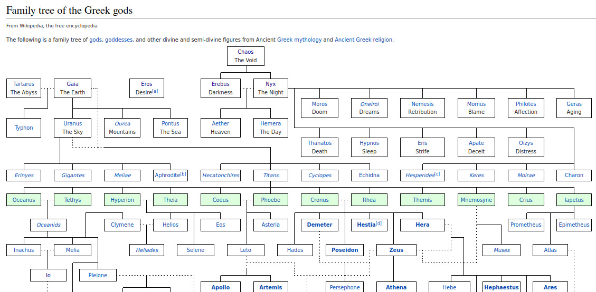
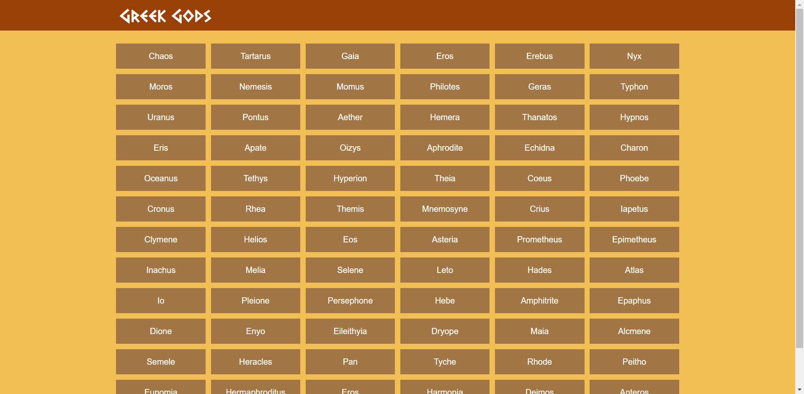
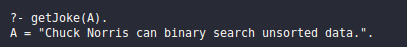

# Trabalho 2 - Aplicação Web em Prolog
Flávio Borin Júnior e Gregori Dallanora Rubin
## 1 - Web Scraping
Para acessarmos informações de uma página na web, o Prolog disponibiliza bibliotecas que suportam requisições HTTP. Com a biblioteca "http_open" podemos acessar a árvore DOM de uma página, que contém os detalhes de como é toda a sua estrutura.
	
```
http_open(Link, Stream, []).
load_html_file(Stream, DOM). %DOM recebe a estrutura da página
close(Stream).
```

Feito isso, utilizamos a biblioteca [xpath](https://www.swi-prolog.org/pldoc/doc_for?object=section(%27packages/sgml.html%27)) do prolog, que, como o nome sugere, nos da suporte à linguagem xpath. Isso nos permite varrer o conteúdo da página em busca de uma informação específica. 
	
```
xpath(DOM, Path, Out). %onde path é o caminho para buscar o elemento
```
A variável Path precisa estar formatada de acordo com o xpath, ou seja, informando as tags HTML nas quais a informação desejada se encontra, por exemplo:

```
//body/div/table(@id = 'tab1')
```

A paǵina escolhida foi [Family tree of the Greek gods](https://en.wikipedia.org/wiki/Family_tree_of_the_Greek_gods) por ter uma estrutura relativamente simples de ser varrida.



Neste caso, buscamos pelo nome e pelo link da página na Wikipedia de cada deus grego presente na lista. Esta operação nos resulta uma lista de elementos estruturados da seguinte maneira:
	
```
god(Nome, Link).
``` 
	
Essas estruturas são declaradas como um objeto json pela biblioteca json_convert, o que nos permite traduzir toda a lista de elementos para o formato JSON.

```
%transforma um elementos do prolog (Dictionary) para JSON
prolog_to_json(D, JsonNames). 
```

A ideia é então criar uma espécie de API que retorna, sempre que acessada, um arquivo JSON que contém uma lista de deuses gregos e seus respectivos links na Wikipedia.

## 2 - Cliente
Além das bibliotecas para requisições HTTP, o Prolog conta com bibliotecas que auxiliam na interação com páginas web. A biblioteca "html_write" permite a criação de páginas HTML e a renderização de elementos nessas páginas.

```
reply_html_page(title('Greek Gods'), link([rel('stylesheet'), href('./style.css')]), D).
```

Os dados exibidos nessa página podem ser buscados através de documentos JSON. Porém, esses dados precisam ser transformados em dados reconhecidos pelo Prolog. A biblioteca "json_convert" permite fazer essas conversões.

```
json_to_prolog(JsonNames, A),
```

Dessa forma, juntamente com um arquivo de estilização CSS, foi possível criar a seguinte página:



## Exercício proposto
Para os testes iniciais sobre o funcionamento das bibliotecas supracitadas, utilizamos uma [api](https://api.chucknorris.io/jokes/random?category=dev) que nos gera piadas do Chuck Norris. Utilizando as bibliotecas citadas e a documentação, faça um código em prolog que envie uma requisição à API e mostre a piada na tela.


	
## Referências consultadas:

- [Swi-prolog HTTP support](https://www.swi-prolog.org/pldoc/doc_for?object=section(%27packages/http.html%27))
- [Swi-prolog SGML/XML parser](https://www.swi-prolog.org/pldoc/doc_for?object=section(%27packages/sgml.html%27))
- [Xpath cheatsheet](https://devhints.io/xpath)
- [Slides](https://docs.google.com/presentation/d/1LL7Fk0Ao-ExhzlIsP45F1qtT9vwAuIuUTr3afHlDiKc/edit?usp=sharing)
